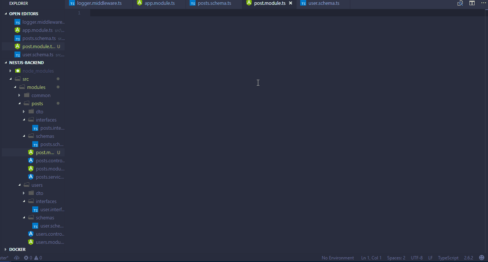

### vscode-nestjs-snippets

  
  <h1 align="center">NESTJS SNIPPETS FOR VSCODE</h1>
  
Adds snippets common operations for working with nestjs in Vscode.

## Screenshot

## Usage
Snippet                                   |Prefix                       | Purpose                                                       |
----------------------------------------| ------------------------------| --------------------------------------------------------------|
Nest Controller                         | n-controller                  | NestJS Controller                                             |
Nest Root Module                        | n-module-root                 | NestJS Root Module                                            |
Nest NestModule                         | n-module-nest                 | NestJS Module Implementing NestModule                         |
Nest Interceptor                        | n-interceptor                 | NestJS Interceptor                                            |
Nest Guard                              | n-guard                       | NestJS Guard                                                  |
Nest Provider                           | n-provider                    | NestJS Provider                                               |
Nest Module                             | n-module                      | NestJS Module                                                 |
Nest Dynamic Module                   	| n-dynamic-module              | Nest Dynamic Module                                           |
Nest Global Module                      | n-module-global               | NestJS Global Module                                          |
Nest Cron Task                          | n-cron-task                   | NestJS Cron Task                                              |
Nest Middleware                         | n-middleware                  | NestJS Middleware                                             |
Nest Pipe                               | n-pipe                        | NestJS Pipe                                                   |
Nest Jwt Strategy                   	  | n-jwt                   	    | Nest Jwt Strategy                                             |
Nest Custom Decorator                   | n-decorator                   | NestJS custom Decorator                                       |
Nest Custom Logger                  	  | n-logger                	    | NestJS custom Logger                                      	  |
Nest Custom Exception                   | n-exception                   | NestJS custom Exception                                       |
Nest TypeORM Entity                     | n-typeorm-entity              | NestJS TypeORM Entity                                         |
Nest TypeORM Repository                 | n-typeorm-repository          | NestJS TypeORM Repository                                     |
Nest Mongoose Service                   | n-mongoose-service            | NestJS Service for Mongoose                                   |
Nest Mongoose Interface                 | n-mongoose-interface          | NestJS Interface for mongoose                                 |
Nest Unit Test                          | n-test                        | NestJS Unit Test                                              |
Nest Sequelize Entity                   | n-sequelize-entity            | NestJS Sequelize Entity                                       |
Nest Sequelize Provider                 | n-sequelize-provider          | NestJS Sequelize Provider                                     |
Nest Sequelize Database Provider        | n-sequelize-database-provider | NestJS Sequelize Provider                                     |
Nest Sequelize Database Provider        | n-sequelize-database-provider | NestJS Sequelize Provider                                     |
NestJS CQRS Query                       | n-cqrs-query                  | NestJS CQRS Query                                             |
NestJS CQRS Query Handler               | n-cqrs-query-handler          | NestJS CQRS Query Handler                                     |
NestJS CQRS Command                     | n-cqrs-command                | NestJS CQRS Command                                           |
NestJS CQRS Command Handler             | n-cqrs-command-handler        | NestJS CQRS Command                                           |

## Installation

1.  Install Visual Studio Code 1.10.0 or higher
1.  Launch Code
1.  From the command palette `Ctrl`-`Shift`-`P` (Windows, Linux) or `Cmd`-`Shift`-`P` (OSX)
1.  Select `Install Extension`
1.  Choose the extension
1.  Reload Visual Studio Code

OR

1.  Type `Ctrl`-`Shift`-`P` (Windows, Linux) or `Cmd`-`Shift`-`P` (OSX)
1.  Type `ext install rubiin.nestjs`

## Contributing

Contributions are highly welcome

## Release Notes

## 1.5.0 - 05-06-2020
